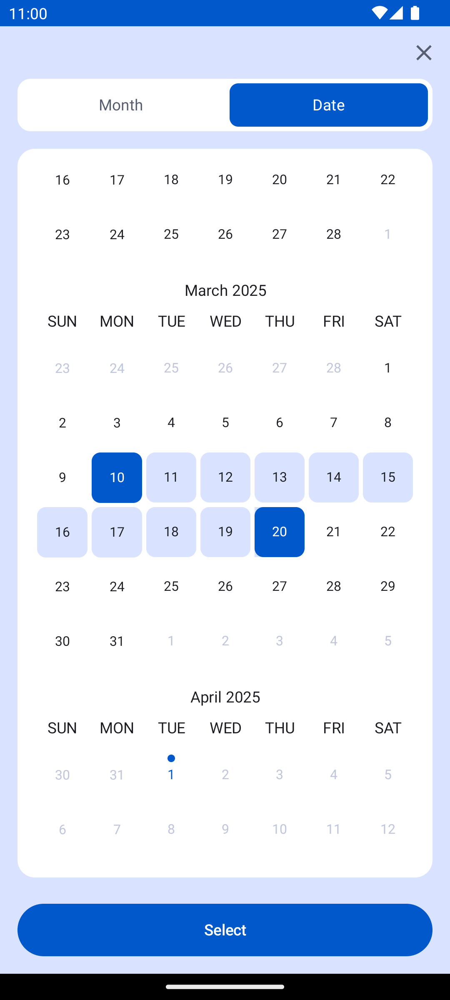
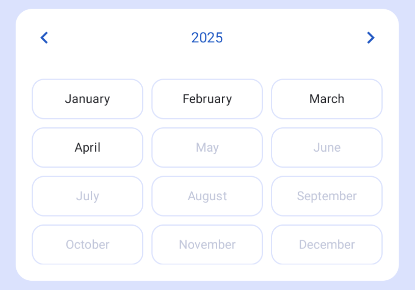
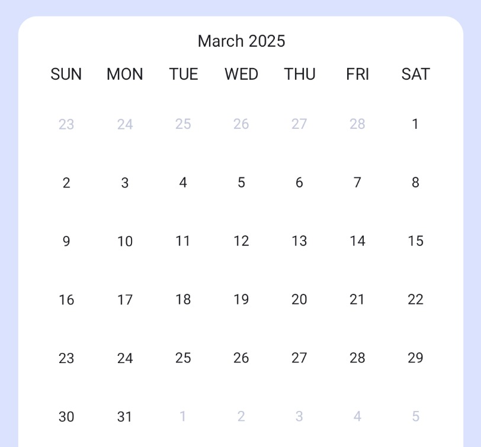

# calendar-android

[](https://central.sonatype.com/namespace/io.github.mobile-development-group)

[](https://stand-with-ukraine.pp.ua)

This new rewritten version library provides a beautiful date picker for Jetpack Compose, following
the latest material 3
guidelines. [Old version](https://github.com/mobile-development-group/ComposeCalendar)



## Dependency

Make sure to add Maven Central to your repositories declarations:

```kts
repositories {
    mavenCentral()
}
```

then add the latest ComposeCalendar version to your `app/build.gradle` file dependencies:

```kts
compileOptions {
    // For support minSdk < 26
    isCoreLibraryDesugaringEnabled = true
}

dependencies {
    implementation("io.github.mobile-development-group:calendar-android:<latest-version>")
}
```

## How to use

Showing the calendar:

#### For select period by months

```kotlin
CalendarYears(  
    selection = monthsDateSelection,  
    minDate = minDate,  
    maxDate = maxDate,  
    onSelectedChanged = {  
        Log.d("Calendar", "Selected period: $it")  
    }  
)
```



#### For select period/date by months

```kotlin
CalendarMonths(  
    selected = selected,  
    minDate = minDay,  
    maxDate = maxDay,  
    isPeriod = true, //or false for select date    
    blockedDates = blockedDates,  
    onSelectedChanged = onSelectedChanged,  
    monthHeader = { month ->  
        MonthHeaderView(month)  
    }  
)
```



#### You can also create your own calendar using

```kotlin
val currentMonth = remember { YearMonth.now() }
val startMonth = remember { LocalDate.now() }
val endMonth = remember { LocalDate.now().plusMonths(1) }
val daysOfWeek = remember { daysOfWeek() }

val state = rememberCalendarState(  
    startMonth = startMonth,  
    endMonth = endMonth,  
    firstVisibleMonth = currentMonth,  
    firstDayOfWeek = daysOfWeek.first()  
)  

VerticalCalendar(  
    state = state,  
    dayContent = { /* Your day content */ },  
    monthHeader = { /* Your month header */ },  
    monthBody = { /* Your month body */ },  
    monthFooter = { /* Your month footer */ },  
    monthContainer = { /* Your month container */ }  
)  
// or  
HorizontalCalendar(  
    state = state,  
    dayContent = { /* Your day content */ },
    ...
)  
```

#### Customization

For customization use `CalendarDefaults.calendarColors()`:
`containerColor` - background calendar color
`chevron` - elements for navigating to the next and previous months  
`itemContainerColor` - background color of calendar items  
`itemSelectedContainerColor` - background color of selected items  
`itemIntermediateContainerColor` - background color of intermediate (range-selected) items  
`itemDisabledContainerColor` - background color of disabled items  
`selectedTextColor` - color of text in selected items  
`textColor` - default text color of calendar items  
`intermediateTextColor` - color of text in intermediate (range-selected) items  
`disabledTextColor` - color of text in disabled items

## Note
Please write to me if you find any errors

## License

This project is licensed under the Apache-2.0 License - see the [LICENSE](LICENSE) file for details.

```
Copyright 2022-2023 Redume

Licensed under the Apache License, Version 2.0 (the "License");
you may not use this file except in compliance with the License.
You may obtain a copy of the License at

   http://www.apache.org/licenses/LICENSE-2.0

Unless required by applicable law or agreed to in writing, software
distributed under the License is distributed on an "AS IS" BASIS,
WITHOUT WARRANTIES OR CONDITIONS OF ANY KIND, either express or implied.
See the License for the specific language governing permissions and
limitations under the License.
```
